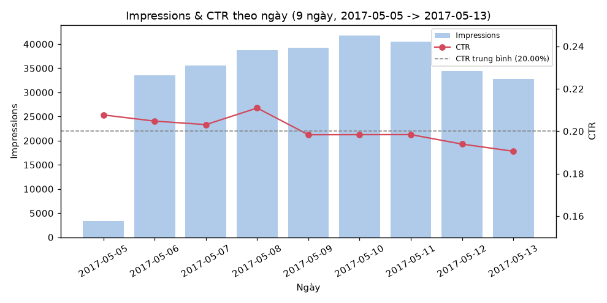
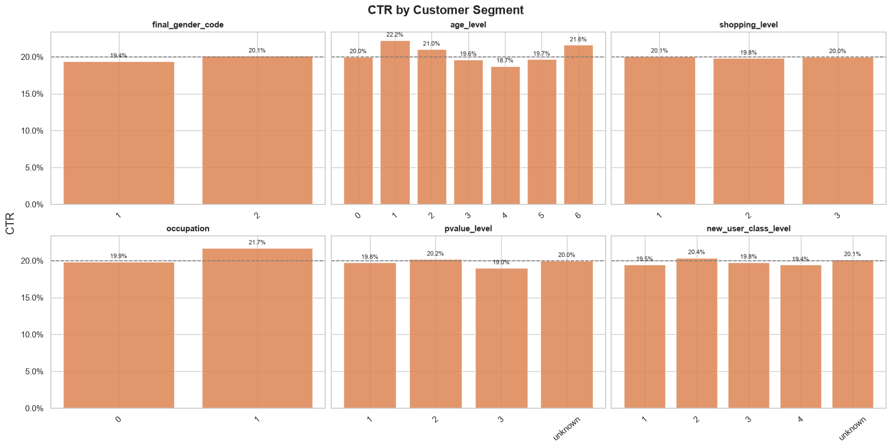
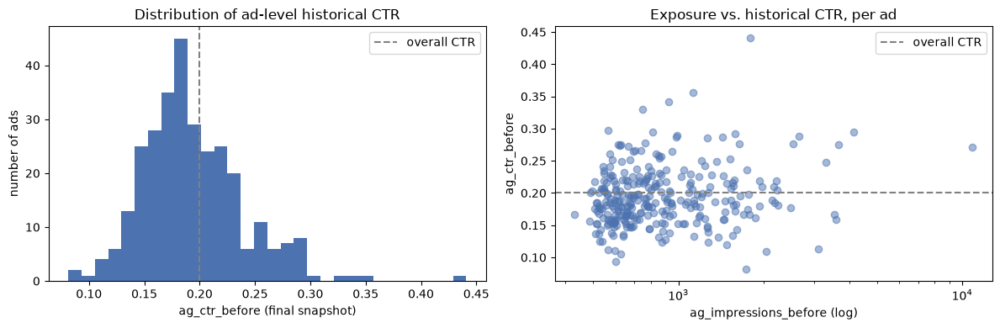
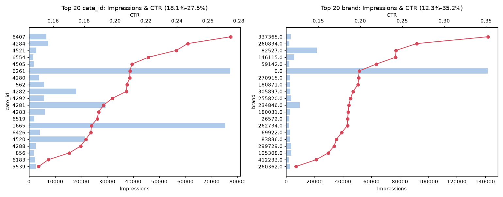
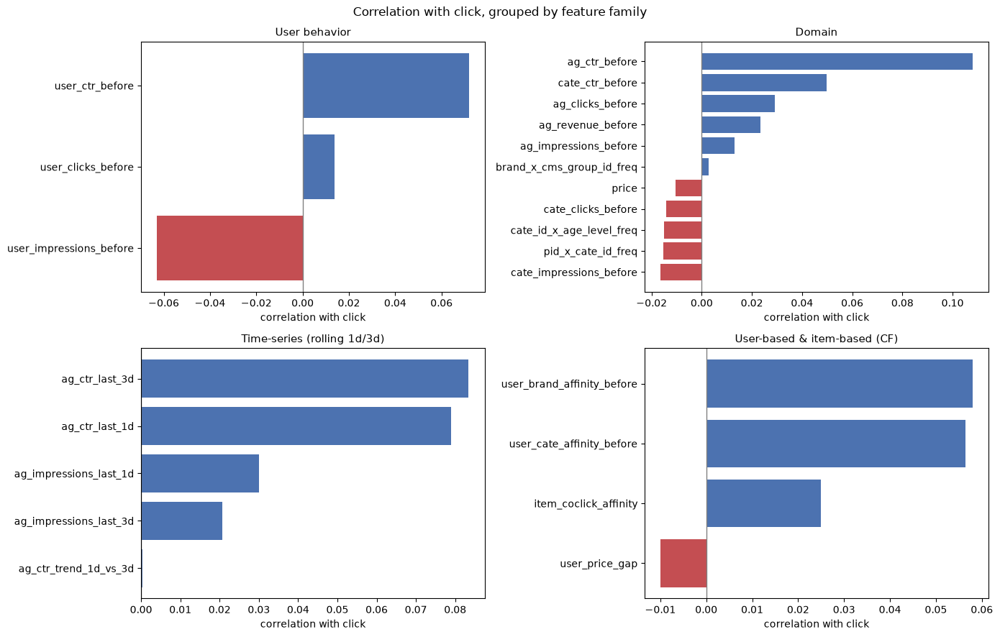
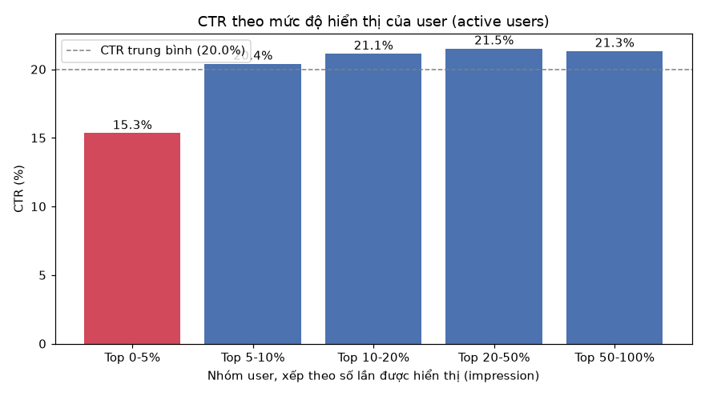
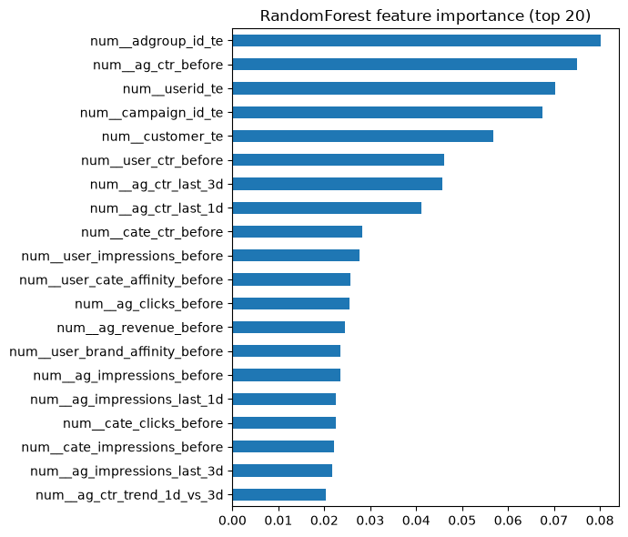

# Báo cáo EDA — Mục tiêu: Tăng CTR

**Mục tiêu**: xác định yếu tố tác động đến CTR và đề xuất hành động.

Nhóm hành động:
- **[Vận hành]** — thay đổi quy trình/serve, không cần train lại model
- **[Feature]** — đưa vào model — ước tính từ thống kê, chưa qua A/B test
- **[Nghiên cứu thêm]** — cần dữ liệu/chuyên môn chưa có

---

## Tổng quan — CTR ban đầu

Nhìn tổng thể trước khi đi vào từng phần, số tự tính từ `input_data/train.csv` + `test.csv`
(300,000 dòng, 2017-05-05 → 2017-05-13, 9 ngày) — phần này chỉ để dễ theo dõi các phần sau, chưa
có action.

**CTR tổng**: 20.00% (train 20.19% / test 19.26%, lệch lớp nhẹ — Phần 0.3).

**Theo ngày**:

CTR gần như không đổi qua các ngày: 19.05%–21.09% (độ lệch chuẩn 0.65%), không thấy khác biệt rõ
giữa ngày trong tuần và cuối tuần — 9 ngày là quá ít để kết luận có mùa vụ (seasonality) hay
không, nên chưa dùng thời gian làm điểm cải thiện CTR.

**Theo các nhóm khác** (top 20 mỗi loại theo số lần hiển thị, chi tiết + hành động ở Phần 3/4):
- `adgroup_id` (từng quảng cáo): 8.1%–44.1% — biên độ lớn nhất.
- `brand`: 12.3%–35.2%.
- `cate_id` (ngành hàng): 15.1%–27.5%.
- Nhân khẩu học (`cms_segid`, `age_level`, ...): 18.7%–22.2% — gần như phẳng (Phần 2).

Xếp theo biên độ: từng quảng cáo > brand > ngành hàng > ngày ≈ nhân khẩu học. Đây là lý do
báo cáo tập trung vào quảng cáo/ngành hàng/brand, thay vì thời gian hay nhân khẩu học.

---

## Tóm tắt Insight & Action

Bảng dưới tổng hợp insight chính và action chính của từng phần — đọc nhanh trước khi vào chi
tiết. Chi tiết đầy đủ (Finding, Trực quan, Feature) nằm ở từng phần tương ứng bên dưới.

| Phần | Insight chính | Action chính |
|---|---|---|
| 0 — Nền tảng dữ liệu | Dữ liệu sạch sau khi fix timestamp; đa số cột là ID/ordinal, không phải quantity | Assert guard khi load; gán role cột trước khi phân tích; dùng AUC/Log Loss |
| 1 — Price | `price` gần như không ảnh hưởng CTR (hạng 18/23); elasticity có ý nghĩa thống kê nhưng quá nhỏ để có giá trị thực tế | `log1p(price)` làm feature rẻ; không đầu tư thêm vào `price` |
| 2 — User segment | Nhân khẩu học không đủ khác biệt để targeting (MI thấp hơn `ag_ctr_before` 18–7000 lần) | Không targeting theo demographic dựa vào CTR |
| 3 — Ad-level quality | Tín hiệu mạnh nhất dataset (CTR 8.1%–44.1%, MI hạng #1/23), nhưng dữ liệu không giải thích được "vì sao" | Target-encode `adgroup_id`; rà soát phân bổ exposure theo CTR/revenue |
| 4 — Category/Brand-level | Biên độ CTR theo `cate_id`/`brand` vẫn đáng kể; thiếu `brand_ctr_before` dù đã có `cate_ctr_before` | Thêm `brand_ctr_before` cùng công thức |
| 5 — Personalization | 3 nguyên nhân riêng biệt: dữ liệu thưa, hệ thống phân bổ sai tần suất cho nhóm CTR thấp, và tín hiệu CF riêng lẻ không hề yếu | Frequency cap cho 5% user bị hiển thị nhiều nhất; kiểm tra model có khai thác đủ affinity feature |
| Kết quả Model | Recall@100 ~0.51 (per-user); CTR tăng 1.24×–1.70× tùy K chọn; rủi ro mix-shift và multicollinearity | Recommendation per-user bằng model; recalibrate xác suất; validation temporal split |
| Hạn chế của Model | Thiếu device/AOV/creative, cold-start nghiêm trọng (chỉ 0.035% catalog có lịch sử), bài toán gốc là ad-serving không phải recommendation đúng nghĩa | Xem 3 bảng chi tiết; cơ hội mở rộng sang recommendation ngoài ads |

---

## Phần 0 — Nền tảng dữ liệu

*(Điều kiện cần, không tự tăng CTR — nếu sai thì mọi phân tích sau không đáng tin.)*

| # | Finding | Action |
|---|---|---|
| 0.1 Toàn vẹn dữ liệu | `train.csv` từng bị Excel làm hỏng timestamp (đã fix); 22,999 dòng trùng `(userid, time_stamp)` hợp lệ, không phải duplicate | **[Vận hành]** Assert guard khi load; không de-dup |
| 0.2 Vai trò cột | 16/19 cột là số nguyên nhưng chỉ `price` là quantity thật — còn lại ID/ordinal/binary/cyclic | **[Feature]** Gán role trước khi phân tích, không áp mean/correlation lên cột ID |
| 0.3 Lệch lớp (class imbalance) | CTR 20.19%/19.26%, tỷ lệ click/không-click ≈ 1:3.95 — lệch nhẹ | **[Vận hành]** Dùng AUC/Log Loss, không dùng accuracy |
| 0.4 Giá trị thiếu | 4 cột dùng `0` làm sentinel; chênh CTR missing-vs-present <0.3pp — không tín hiệu | **[Feature]** Coi `0` là `"unknown"`; không impute, không thêm `_is_missing` |

---

## Phần 1 — Price

**Finding**: Phân phối `price` lệch mạnh (skew 1.964), giảm còn −0.53 sau khi biến đổi `log1p`; chỉ
159 mức giá cho 300 quảng cáo; CTR chia theo 10 nhóm giá (decile) gần như bằng nhau (0.174–0.229)
— một mình `price` gần như không ảnh hưởng đến CTR. Đã test interaction giữa `price` và
`pvalue_level` nhưng không cải thiện được model (AUC test giảm nhẹ). Kiểm tra lại bằng MI và
Cliff's delta (`EDA/EDA.ipynb` mục 5) cho cùng kết luận: `price` xếp hạng 18/23 feature.

**Elasticity**: chạy logistic regression `click ~ log1p(price)` trên 300k dòng — hệ số −0.0432
(p=1.45×10⁻¹⁴): giá tăng gấp đôi thì odds click giảm khoảng 3%. Mẫu đủ lớn nên có ý nghĩa thống
kê, nhưng effect size quá nhỏ để có giá trị thực tế.

**Action**:
- **[Feature]** `log1p(price)` + `StandardScaler` (train only) — rẻ, nên làm.
- **[Nghiên cứu thêm]** Bỏ cross `price × pvalue_level`. Nếu muốn khai thác `price`, cross với
  `cate_id`/`adgroup_id` (Phần 3) có căn cứ hơn.
- **[Vận hành]** Thử tie-break ưu tiên giá thấp khi rank ngang nhau — effect nhỏ (~3%), nên A/B
  test trước.

---

## Phần 2 — User segment targeting

**Finding** — Mutual Information với `click` (`EDA/EDA.ipynb` mục 5):

| Feature | MI |
|---|---|
| `cms_segid` | 0.000387 (cao nhất) |
| `age_level` | 0.000316 |
| `occupation` | 0.000072 |
| `new_user_class_level` | 0.000041 |
| `final_gender_code` | 0.000019 |
| `pvalue_level` | 0.000013 |
| `shopping_level` | 0.000001 |

**Trực quan** (`EDA/EDA.ipynb` mục 7):

Toàn bộ CTR theo segment nằm sát đường tham chiếu 20% (18.7%–22.2%) — xác nhận trực quan cho
bảng MI: không segment nào tách biệt rõ rệt khỏi mức trung bình.

**Insight**: MI của mọi cột nhân khẩu học đều rất nhỏ so với `ag_ctr_before` (0.0071, Phần 3) —
thấp hơn 18–7000 lần. Không có nhóm khách hàng nào đủ khác biệt để nhắm riêng (targeting).

**Feature**:
- One-hot toàn bộ 7 cột (2–52 mức) — không target-encode.
- Đã kiểm tra: kết hợp `adgroup_id × cms_group_id` → AUC tăng thêm +0.0005 (không đáng kể).
- Các kết hợp khác đã có sẵn trong pipeline: `pid × cate_id`, `cate_id × age_level`,
  `brand × cms_group_id`.

**Action**:
- **[Vận hành]** Không targeting theo segment demographic dựa vào CTR — chênh lệch quá nhỏ.
- **[Nghiên cứu thêm]** Nếu muốn targeting theo city tier/purchasing power, đo bằng AOV thay vì
  CTR — chưa có dữ liệu đơn hàng.

---

## Phần 3 — Ad-level quality

**Finding**: CTR theo từng quảng cáo (300 quảng cáo, ≥200 lượt hiển thị) dao động 8.1%–44.1% —
biên độ lớn nhất trong toàn bộ dataset. `adgroup_id` tương ứng 1-1 với
`cate_id`/`brand`/`campaign_id`/`customer` (đã kiểm tra trên toàn bộ 846,811 quảng cáo) —
217/248 `campaign_id` chỉ có 1 quảng cáo. Chỉ 6/15 quảng cáo hiển thị nhiều nhất cũng nằm trong
top doanh thu; có quảng cáo giá cao và CTR tốt (`819177`, ¥999, CTR 20.5%) nhưng lại được hiển
thị quá ít.

**Trực quan** (`EDA/EDA.ipynb` mục 9):

Histogram (trái) thể hiện trực tiếp biên độ 8.1%–44.1% đã nêu ở Finding. Scatter (phải)
cho thấy không có quan hệ rõ ràng giữa số lần hiển thị trước đó (`ag_impressions_before`) và CTR
lịch sử — quảng cáo ít được hiển thị vẫn có thể CTR cao, ủng hộ nhận định rằng CTR tốt là thuộc
tính riêng của từng quảng cáo, không phải kết quả của việc được hiển thị nhiều.

**Insight**: Đây là tín hiệu mạnh nhất trong dataset, nhưng dữ liệu chỉ cho biết quảng cáo nào tốt,
không giải thích được vì sao (cần dữ liệu về nội dung/hình ảnh quảng cáo). `campaign_id`/`customer`
là thông tin dư thừa (trùng với `adgroup_id`), đưa vào model chỉ lặp lại tín hiệu đã có. Kiểm tra
lại bằng MI (`EDA/EDA.ipynb` mục 5): `ag_ctr_before` xếp hạng #1/23 (0.72). MI đo được là của
`ag_ctr_before` (feature đã tính sẵn) — mục 5 không tính MI cho `adgroup_id`/`userid` vì coi đây
là mã định danh. Xét bằng Cliff's delta thô (khác với combined score dùng ở trên): `ag_ctr_before`
chỉ đạt δ=0.150 — mức **nhỏ** theo ngưỡng Romano (xem giải thích ở Phụ lục), và là feature duy nhất trong 23
feature vượt qua mức không-đáng-kể (0.147). Tức là ngay cả tín hiệu mạnh nhất dataset, xét riêng
từng feature một cũng chỉ ở mức nhỏ — đây là lý do model cần kết hợp nhiều feature yếu lại mới đạt
AUC 0.607 (Kết quả Model).

Biến động ngắn hạn (`EDA/EDA.ipynb` mục 9, "trending ads"): có quảng cáo mà CTR 1 ngày gần nhất
(`ag_ctr_last_1d`) lệch nhiều so với CTR trung bình 3 ngày (`ag_ctr_last_3d`) — tăng mạnh nhất
+0.091 (`744133`), giảm mạnh nhất −0.152 (`695844`). Biến động từng quảng cáo là có thật, nhưng
khi đo correlation của chính feature `ag_ctr_trend_1d_vs_3d` với `click` trên toàn bộ dataset thì
gần như bằng 0 (0.0004, Phần 5) — biến động ngắn hạn của một vài quảng cáo không đủ để trở thành
tín hiệu dự đoán ổn định trên diện rộng.

**Feature**:
- Target-encode `adgroup_id` (mã hoá theo CTR trung bình, dùng 5-fold OOF + smoothing=20, chỉ
  tính trên tập train để tránh rò rỉ dữ liệu).
- Feature tính theo lịch sử (leak-safe, chỉ dùng dữ liệu trước thời điểm hiện tại):
  `ag_clicks_before`, `ag_impressions_before`, `ag_ctr_before`, `ag_revenue_before`,
  `ag_ctr_last_1d`/`_3d`, `ag_ctr_trend_1d_vs_3d`.
- Bỏ `campaign_id`, `customer` (dư thừa). Giữ one-hot `cate_id`/`brand` làm backoff (chi tiết —
  Phần 4).
- Không dùng count/frequency-encoding cho cột ID — đã thử và cho kết quả tệ hơn, do lệch phân
  phối giữa train/test (mix-shift — xem Kết quả Model & Kỳ vọng tăng CTR).

**Action**:
- **[Vận hành]** Rà soát thuật toán phân bổ exposure — ưu tiên CTR/revenue thay vì impression
  count.
- **[Nghiên cứu thêm]** Phối hợp Product/Marketing tìm nguyên nhân — cần dữ liệu creative.

---

## Phần 4 — Category/Brand-level quality

**Finding**: CTR theo `cate_id` (top 20 theo impression, `EDA/EDA.ipynb` mục 3) dao động
15.1%–27.5%; theo `brand` (mục 4) dao động 12.3%–35.2% (loại `brand` = `unknown`, CTR 19.9% ~
baseline). Biên độ nhỏ hơn ad-level (Phần 3: 8.1%–44.1%) nhưng vẫn đáng kể.

**Trực quan** — số tự tính lại từ `input_data/train.csv` + `test.csv` (notebook mục 3/4 chỉ xuất
biểu đồ Plotly tương tác, không có ảnh tĩnh để nhúng):

**Insight**: `adgroup_id` tương ứng 1-1 với `cate_id`/`brand` (Phần 3), nên phần lớn biên độ ở đây
đã được `ag_ctr_before` (target-encoding theo ad) nắm bắt. Giá trị riêng của `cate_id`/`brand` nằm
ở khả năng generalize cho ad mới/ít dữ liệu — khi đó `adgroup_id_te` chưa có lịch sử, nhưng
`cate_id`/`brand` (nhóm rộng hơn) vẫn còn tín hiệu để dùng tạm. Pipeline (`medallion/gold/
features.py`, dòng 161) đã có `cate_ctr_before` nhưng chưa có `brand_ctr_before` tương ứng, dù
brand có biên độ CTR rộng hơn cate_id (35.2% vs 27.5%).

**Feature**:
- Đã có: `cate_clicks_before`, `cate_impressions_before`, `cate_ctr_before` (domain, leak-safe).
- Thiếu: `brand_clicks_before`/`_impressions_before`/`_ctr_before` — cùng công thức, chưa có.
- One-hot `cate_id`/`brand` (Phần 3) giữ nguyên vai trò backoff cho ad mới.

**Action**:
- **[Feature]** Thêm `brand_ctr_before` cùng bộ (`_clicks_before`, `_impressions_before`) theo
  đúng công thức cumulative-before leak-safe đang dùng cho `cate_ctr_before`.

---

## Phần 5 — Personalization

**Finding** — Đối chiếu correlation-with-click theo 4 nhóm feature (`EDA/EDA.ipynb` mục 5):

Nhóm **User-based & item-based (CF)** có correlation dương rõ rệt: `user_brand_affinity_before`
(~0.06), `user_cate_affinity_before` (~0.055), `item_coclick_affinity` (~0.025). Nhóm **User
behavior**: `user_ctr_before` dương (~0.07) nhưng `user_impressions_before` **âm** (~−0.06) — user
càng bị hiển thị nhiều lần trước đó thì càng ít có khả năng click ở lần tiếp theo, dấu hiệu "mỏi
quảng cáo" (ad fatigue), ngược với suy luận thông thường.

Cùng hướng này, chia 174,283 active user (`EDA/EDA.ipynb` mục 8) thành 5 nhóm theo **số lần
chính user đó được hiển thị quảng cáo** (tổng impression nhận được trong 9 ngày) — đây là top X%
**user theo tần suất hiển thị**, khác với top X% **impression theo điểm model** ở phần Kết quả
Model bên dưới (hai trục khác nhau: một bên là user bị phục vụ bao nhiêu lần, một bên là chọn ad
nào để phục vụ trong 1 lần cụ thể):

| Nhóm | Số user | Số lần hiển thị/user (trung bình) | CTR |
|---|---|---|---|
| Top 0–5% | 8,714 | 7.19 | 15.3% |
| Top 5–10% | 8,714 | 3.53 | 20.4% |
| Top 10–20% | 17,428 | 2.48 | 21.1% |
| Top 20–50% | 52,285 | 1.46 | 21.5% |
| Top 50–100% | 87,142 | 1.00 | 21.3% |

Nhóm user bị phục vụ nhiều nhất lại là nhóm convert kém nhất, không phải tốt nhất.

**Insight**: có 3 điểm tách biệt cần đọc riêng, không gộp chung thành một kết luận.

1. **Vì sao cá nhân hóa nhìn có vẻ yếu ở mức tổng thể**: 300,000 impression chia cho 174,283
   active user (16.41% catalog 1,061,768 user) — trung bình chỉ **1.72 impression/user**, và
   66.21% active user chỉ xuất hiện đúng 1 lần trong log. Với 1 lần xem, model gần như không có
   lịch sử để cá nhân hóa cho user đó — đây thuần túy là vấn đề **dữ liệu quá thưa (sparse)**,
   không phải feature cá nhân hóa kém.
2. **Vấn đề vận hành, độc lập với chất lượng model**: top 10% user hoạt động nhiều nhất chiếm
   39.42% impression nhưng chỉ tạo 35.23% click (Gini = 0.335). Quan trọng hơn, bucket CTR ở trên
   cho thấy nhóm 0–5% user được hiển thị nhiều nhất lại có CTR thấp nhất (15.3%) — hệ thống đang
   phân bổ quá nhiều impression cho đúng nhóm có khả năng click thấp. Đây không phải lỗi của
   ranking model (model vẫn chọn ad tốt nhất mỗi khi được gọi), mà là vấn đề ở lớp phân phối
   impression/tần suất phục vụ diễn ra **trước** ranking. Giải pháp phù hợp vì vậy là frequency
   cap hoặc điều chỉnh phân bổ impression (Action) — thuộc về cách vận hành hiện tại, không phải
   do thiếu dữ liệu hay do model.
3. **Ở mức feature riêng lẻ, tín hiệu cá nhân hóa không hề yếu**: `user_brand_affinity_before`
   (0.647) và `user_cate_affinity_before` (0.646) vẫn hạng #2–#3 combined score (Pearson/MI/
   Cliff's delta) — chỉ sau `ag_ctr_before` (0.721). Nghĩa là bản thân feature cá nhân hóa đo được
   tín hiệu tốt; điểm (1) và (2) ở trên là hai lý do khác khiến hiệu quả thực tế bị giảm, không
   phải do feature yếu.

**Feature**: `item_coclick_affinity`, `user_cate_affinity_before`, `user_brand_affinity_before`,
`user_price_gap`.

**Action**:
- **[Vận hành]** Áp frequency cap/decay ở lớp phục vụ (trước top-K ranking) cho 5% user bị hiển
  thị nhiều nhất — nhóm này CTR thấp nhất (15.3%), giảm số lần phục vụ ở đây không mất nhiều
  click. Đây là chỉnh tần suất phục vụ, không phải thay đổi cách chọn ad (top-K).
- **[Nghiên cứu thêm]** Kiểm tra model có khai thác đủ `user_brand/cate_affinity_before` không
  (xem hạng thật trong feature importance ở phần Kết quả Model bên dưới) trước khi kết luận
  personalization không đáng đầu tư.

---

## Kết quả Model & Kỳ vọng tăng CTR

**Finding**:

| Model | AUC | Recall@10 | Recall@20 | Recall@50 | Recall@100 |
|---|---|---|---|---|---|
| RandomForest (tốt nhất) | 0.607 | 0.099 | 0.157 | 0.340 | 0.513 |
| HistGradientBoosting | 0.606 | 0.079 | 0.143 | 0.306 | 0.495 |
| LogisticRegression | 0.605 | 0.095 | 0.165 | 0.324 | 0.495 |
| LightGBM | 0.603 | 0.073 | 0.136 | 0.301 | 0.500 |
| XGBoost | 0.603 | 0.082 | 0.144 | 0.308 | 0.495 |
| Random baseline | 0.500 | 0.034 | 0.068 | 0.173 | 0.338 |

CTR-lift (RandomForest, 60,000 impression test, baseline 19.26%):

| Top X% | CTR | Lift |
|---|---|---|
| 5% | 32.8% | 1.70× |
| 10% | 30.5% | 1.58× |
| 20% | 28.0% | 1.45× |
| 50% | 24.0% | 1.24× |
| 100% | 19.3% | 1.00× |

**Trực quan** (`experiment/Full_Training_Model.ipynb`):

**Insight**: Recall@K là metric chính, lấy user làm trọng tâm, đúng tinh thần recommendation —
với từng user, nếu chỉ chọn K ad trong toàn bộ candidate của họ, có bắt được đúng ad họ thực sự
click không? RandomForest: Recall@10 = 0.099 (chọn 10 candidate/user bắt được ~10% lượt click
thật), Recall@100 = 0.513 (chọn 100 candidate/user bắt được ~51%).

AUC tốt nhất chỉ 0.607 — cải thiện thật nhưng khiêm tốn. Feature importance thật cho thấy tín hiệu
tập trung ở `adgroup_id_te`, `ag_ctr_before`, và các target-encoding ID khác —
`user_brand_affinity_before`/`user_cate_affinity_before` (Phần 5) chỉ xếp hạng ~11 và ~15, thấp
hơn nhiều so với vị trí #2–#3 ở combined score đo riêng lẻ.

**Kỳ vọng tăng CTR**: nếu dùng model để ưu tiên đề xuất (chỉ đề xuất candidate điểm cao thay vì
ngẫu nhiên), CTR thực tế đạt được tăng theo mức độ chọn lọc — chọn gắt nhất (top 5% điểm cao
nhất) → CTR 32.8%, gấp **1.70×** baseline 19.26%; nới dần ra top 10–50% thì CTR giảm dần
(30.5%→28.0%→24.0%); không chọn lọc gì (100%) thì về đúng baseline (lift 1.00×, theo định nghĩa).
Không có một con số "tăng X%" cố định — càng chọn lọc thì CTR càng cao nhưng độ phủ càng thấp, đây
là đánh đổi cần cân nhắc khi chọn K.

Rủi ro đọc số liệu: TVD `adgroup_id` giữa train/test = 0.277 (lớn) → gap validation/test nên đọc
là mix-shift trước khi kết luận overfitting.

Rủi ro feature engineering: kiểm tra correlation giữa các feature số với nhau (`EDA/EDA.ipynb`
mục 5, multicollinearity check) cho thấy nhiều cặp gần như trùng lặp — `cate_clicks_before` với
`cate_impressions_before` (r=0.997), `ag_clicks_before` với `ag_impressions_before` (r=0.977),
`price` với `user_price_gap` (r=0.94), `ag_ctr_last_1d` với `ag_ctr_last_3d` (r=0.92). Tree-based
model (RandomForest) ít bị ảnh hưởng, nhưng nếu sau này dùng lại LogisticRegression làm production
model, các cặp này nên rút gọn hoặc regularize (L1/L2) để tránh hệ số không ổn định.

**Action**:
- **[Vận hành]** Recommendation cho từng user: rank candidate ad của riêng user đó bằng model,
  chọn top K — CTR kỳ vọng tăng 1.24×–1.70× tùy K chọn (bảng CTR-lift), Recall@100 ~0.51.
- **[Vận hành]** Recalibrate xác suất trước khi dùng ngưỡng production (train ở 20%, thực tế ~5%
  — Phụ lục).
- **[Vận hành]** Validation dùng temporal split, không random `KFold`; báo cáo kèm TVD.

---

## Hạn chế của Model

### Về dữ liệu

| # | Hạn chế | Action |
|---|---|---|
| Thiếu device/platform | Không có cột nào mô tả thiết bị/OS/app version — `pid` (2 giá trị trong sample) chỉ là vị trí hiển thị trên trang, không phải loại thiết bị | **[Nghiên cứu thêm]** Nếu muốn cá nhân hóa theo context thiết bị, cần thu thập thêm — hiện không có |
| Dữ liệu thưa (sparse) | Trung bình 1.72 impression/active user, 66.21% active user chỉ xem 1 lần (Phần 5) | **[Nghiên cứu thêm]** Personalization theo user cần nhiều lịch sử hơn (Phần 5, điểm 1) |
| Cold-start item nghiêm trọng | Chỉ 300/846,811 ad (0.035% catalog) từng xuất hiện trong log được sample — mọi domain feature (`ag_ctr_before`,...) chỉ có giá trị thật cho 0.035% catalog | **[Nghiên cứu thêm]** Cần chiến lược riêng cho ad mới (content-based, không dựa lịch sử) |
| Cold-start user | 83.59% user trong catalog đầy đủ chưa từng xuất hiện trong log (Phụ lục) | **[Nghiên cứu thêm]** Tương tự cold-start item, ở phía user |
| Thiếu dữ liệu creative | Không có nội dung/hình ảnh quảng cáo — biết ad nào tốt nhưng không biết vì sao (Phần 3) | **[Nghiên cứu thêm]** Phối hợp Product/Marketing (Phần 3) |
| Thiếu dữ liệu đơn hàng/AOV | Chỉ có CTR, không có giá trị đơn hàng thật (Phần 2) | **[Nghiên cứu thêm]** Đo AOV theo segment nếu muốn tối ưu doanh thu, không chỉ CTR |
| Cửa sổ thời gian ngắn | Chỉ 9 ngày dữ liệu (Tổng quan) — không đủ để học mùa vụ dài hạn | **[Nghiên cứu thêm]** Không dùng `time` làm lever hiện tại |

### Về model

| # | Hạn chế | Action |
|---|---|---|
| Tín hiệu từng feature yếu, AUC khiêm tốn | Cliff's delta lớn nhất chỉ 0.150 ("nhỏ"), AUC tốt nhất 0.607 (Phần 3, Kết quả Model) | **[Feature]** Dùng tree-based (đã chọn RandomForest), không dùng linear model đơn giản; bổ sung `brand_ctr_before` (Phần 4) hoặc dữ liệu creative để tăng thêm |
| Rủi ro mix-shift | TVD `adgroup_id` train/test = 0.277 (lớn) — gap có thể đọc nhầm là overfit (Kết quả Model) | **[Vận hành]** Validation dùng temporal split, báo cáo kèm TVD (Kết quả Model) |
| Multicollinearity | Một số cặp feature r>0.9 (`cate_clicks_before`/`cate_impressions_before`,...) — rủi ro nếu đổi sang linear model (Kết quả Model) | **[Nghiên cứu thêm]** Rút gọn/regularize nếu dùng lại LogisticRegression |
| Gap combined score vs. feature importance thật | `user_brand/cate_affinity_before` hạng #2–#3 theo thống kê riêng lẻ nhưng model chỉ xếp ~#11/#15 (Kết quả Model) | **[Nghiên cứu thêm]** Kiểm tra model có khai thác đủ 2 feature này (Phần 5) |
| Cold-start truyền vào model | Cold-start item/user (bảng Dữ liệu) khiến domain/CF feature về giá trị mặc định cho ad/user mới, model phải dựa vào one-hot `cate_id`/`brand` (yếu hơn, Phần 3/4) | **[Nghiên cứu thêm]** Cần chiến lược serve riêng cho ad/user mới, không dựa vào feature lịch sử |

### Về business

| # | Hạn chế | Action |
|---|---|---|
| Bài toán gốc là CTR ad, không phải recommendation | Dataset xuất phát từ CTR prediction ad-serving của Alibaba (LS-PLM, Gai et al. 2017, [arXiv:1704.05194](https://arxiv.org/abs/1704.05194)), không phải tối ưu sở thích user trên cả catalog — ad đã được lọc sẵn qua đấu giá/target advertiser | **[Nghiên cứu thêm]** Muốn recommendation đúng nghĩa cần dữ liệu duyệt/mua hàng tự nhiên, không chỉ log ad |
| Thiếu context thiết bị | Không cá nhân hóa được theo thiết bị/kênh truy cập | **[Nghiên cứu thêm]** Thu thập device/platform |
| Thiếu AOV/đơn hàng | Tối ưu theo CTR có thể lệch khỏi tối ưu doanh thu thật | **[Nghiên cứu thêm]** Đo AOV/doanh thu thật trước khi commit ngân sách theo CTR-lift |
| Thiếu creative | Biết ad nào tốt nhưng không biết vì sao, content/marketing thiếu insight hành động | **[Nghiên cứu thêm]** Thu thập dữ liệu creative (Phần 3) |
| Cold-start ảnh hưởng launch sản phẩm mới | 0.035% catalog có lịch sử — sản phẩm/ad mới bị serve kém chính xác hơn hẳn | **[Vận hành]** Cơ chế explore/exposure tối thiểu riêng cho ad mới |
| Cơ hội mở rộng: recommendation ngoài ads | Feature CF sẵn có (`item_coclick_affinity`, `user_cate/brand_affinity_before`, Phần 5) không đặc thù cho ad, dùng được cho gợi ý sản phẩm trên giao diện — nhưng đang bị lệch theo tập 300 ad đã quảng cáo, chưa phản ánh cả catalog | **[Nghiên cứu thêm]** Thử nghiệm recommendation dùng CF feature sẵn có làm điểm khởi đầu; cần dữ liệu duyệt/mua hàng để mở rộng ra cả catalog |
| Cơ hội mở rộng: ad-serving threshold | Bảng CTR-lift (Kết quả Model) tính trên toàn bộ impression gộp lại, không tách theo từng user — đọc đúng hơn ở góc độ "nên đặt ngưỡng điểm phục vụ chung ở đâu" (ad-serving), khác với recommendation per-user là trọng tâm chính của report này | **[Nghiên cứu thêm]** Nếu muốn khai thác thêm lever này, cần đánh giá riêng ở tầng ad-serving, ngoài phạm vi recommendation |

---

## Ưu tiên hành động (Effort × Impact × Confidence)

| Action | Effort | Impact | Confidence | Ưu tiên |
|---|---|---|---|---|
| Guard timestamp khi load (0.1) | Rất thấp | Thấp, rủi ro cao nếu bỏ qua | Cao | 🟢 Làm ngay |
| Dùng AUC/Log Loss thay accuracy (0.3) | Rất thấp | Trung bình | Cao | 🟢 Làm ngay |
| Gán role cột trước khi phân tích (0.2) | Thấp | Nền tảng, gián tiếp | Cao | 🟢 Làm ngay |
| `"unknown"` category cho sentinel, bỏ `_is_missing` (0.4) | Thấp | Thấp–Trung bình | Cao | 🟢 Làm ngay |
| `log1p(price)` + `StandardScaler` (Phần 1) | Thấp | Thấp | Cao | 🟢 Làm ngay |
| Target-encode `adgroup_id`, domain feature, drop `campaign_id`/`customer` (Phần 3) | Thấp (đã có trong pipeline) | Cao | Cao | 🟢 Làm ngay |
| Không phân bổ ngân sách theo segment demographic (Phần 2) | Không | Trung bình | Cao | 🟢 Làm ngay |
| Temporal split + báo cáo kèm TVD (Kết quả Model) | Thấp | Trung bình | Cao | 🟢 Làm ngay |
| Frequency cap cho top 0–5% user impression (Phần 5) | Thấp | Trung bình (CTR nhóm này 15.3%, thấp nhất) | Cao | 🟢 Làm ngay |
| Recommendation per-user: rank candidate ad bằng model, chọn top K (Kết quả Model) | Trung bình | Cao (Recall@100 ~0.51, CTR-lift 1.24×–1.70×) | Cao | 🟡 Làm sớm |
| Recalibrate xác suất trước khi dùng ngưỡng production (Kết quả Model) | Trung bình | Cao nếu triển khai thật | Cao | 🟡 Làm sớm |
| Rà soát thuật toán phân bổ exposure (Phần 3) | Trung bình–Cao | Cao | Trung bình (chưa A/B test) | 🟡 Làm sớm |
| Thêm `brand_ctr_before` domain feature (Phần 4) | Thấp (cùng công thức `cate_ctr_before` có sẵn) | Trung bình | Cao | 🟡 Làm sớm |
| Thử cross `price × cate_id`/`adgroup_id` (Phần 1) | Trung bình | Chưa biết | Thấp | 🔵 Thử nghiệm nhỏ |
| Tie-break ưu tiên giá thấp khi rank ngang nhau (Phần 1) | Thấp | Rất nhỏ (~3%, đã đo) | Cao | 🔵 Thử nghiệm nhỏ |
| Kiểm tra model có khai thác đủ `user_brand/cate_affinity_before` (Phần 5) | Thấp–Trung bình | Chưa biết, feature mạnh #2–#3 | Trung bình | 🔵 Thử nghiệm nhỏ |
| Rút gọn/regularize feature trùng lặp nếu đổi sang linear model (Hạn chế) | Thấp | Thấp (chỉ cần nếu đổi model) | Cao | 🔵 Thử nghiệm nhỏ |
| Thử nghiệm recommendation ngoài ads, dùng CF feature sẵn có (Hạn chế) | Thấp (feature đã có) | Chưa biết, tiềm năng chiến lược | Thấp | 🔵 Thử nghiệm nhỏ |
| Chiến lược serve riêng cho ad/user cold-start (Hạn chế) | Trung bình–Cao | Cao nếu launch sản phẩm mới thường xuyên | Thấp | 🔵 Thử nghiệm nhỏ |
| Đo AOV theo segment nếu vẫn muốn targeting (Phần 2) | Cao (chưa có dữ liệu) | Chưa biết | Thấp | ⚪ Cần thêm dữ liệu |
| Phối hợp Product/Marketing tìm nguyên nhân ad tốt (Phần 3) | Cao | Tiềm năng cao, dài hạn | Thấp | ⚪ Cần thêm dữ liệu/chuyên môn |
| Thu thập dữ liệu device/platform (Hạn chế) | Cao (chưa có dữ liệu) | Chưa biết | Thấp | ⚪ Cần thêm dữ liệu |

---

## Phụ lục — Giới hạn CTR trong dataset

1. **Nguồn**: Taobao Display Ad Click (Alibaba/Tianchi), qua [Kaggle](https://www.kaggle.com/datasets/pavansanagapati/ad-displayclick-data-on-taobaocom) — gốc ~26 triệu dòng, 1,061,768 user.
2. **Downsample**: 26 triệu dòng quá lớn để xử lý (máy cá nhân) → lấy mẫu 300,000 dòng, chia theo thời gian: `train.csv` 240,000 + `test.csv` 60,000 (2017-05-05 → 05-13). Chỉ log impression bị downsample — 2 bảng `ad_feature` (846,811 ad) và `user_profile` (1,061,768 user) giữ nguyên đầy đủ, nên chỉ 16.41% user active là do log không rơi vào mẫu, không phải 83.59% còn lại không tồn tại.
3. **CTR không đại diện thực tế**: mẫu 19–20% chỉ để học, CTR Taobao thật ~5%. AUC/Recall@K/CTR-lift chỉ so sánh model với nhau, không dùng ước tính doanh thu.
4. **`[Feature]`** trong report = ước tính offline, chưa A/B test.
5. **Vì sao dùng Cliff's delta thay vì chỉ p-value**: n=300,000 nên p-value hầu như luôn <0.001 dù effect nhỏ — không phân biệt được "có khác biệt" và "khác biệt đáng kể". Cliff's delta (từ Mann-Whitney U, [-1,1], không phồng theo cỡ mẫu) đo đúng độ lớn khác biệt. Ngưỡng (Romano 2006): <0.147 negligible, <0.33 small, <0.474 medium, còn lại large. Kết hợp thêm Pearson r + MI thành combined score.
